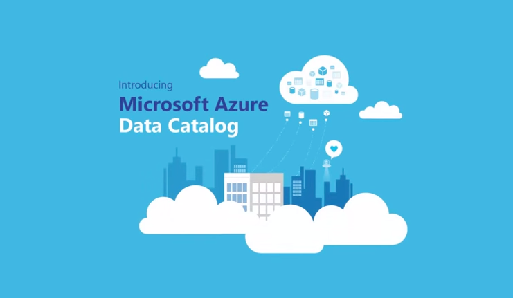

# Global AI Bootcamp2019
AI from Space using Azure presentation and source code


Introduction to technologies and frameworks for Deep Learning using satellite data and moving to production with Azure.


## Azure Open Data Catalog 


https://azure.microsoft.com/en-us/services/open-datasets/catalog


## Raster-Vision


https://docs.rastervision.io/en/0.10/

## Setting up Azure Batch

### Create a resource group
```
az group create \
    --name AIBootcamp2019 \
    --location westeurope
```

### Create a storage account
```
az storage account create \
    --resource-group AIBootcamp2019 \
    --name AIBootcamp2019storageaccount \
    --location westeurope\
    --sku Standard_LRS
```

### Create a Batch account
```
az batch account create \
    --name AIBootcamp2019batchaccount \
    --storage-account AIBootcamp2019storageaccount \
    --resource-group AIBootcamp2019 \
    --location westeurope
```


### Log in my batch account
```
az batch account login \
    --name AIBootcamp2019batchaccount \
    --resource-group AIBootcamp2019 \
    --shared-key-auth
```

### Delete the pool
```
az batch pool delete --pool-id mypool
```


### Delete the resource group
```
az group delete --name AIBootcamp2019 
```